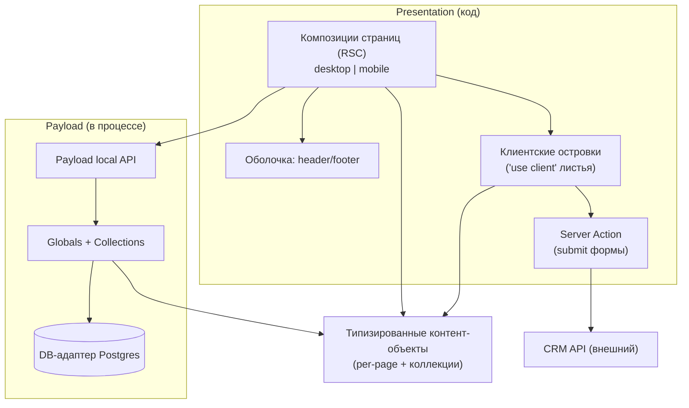
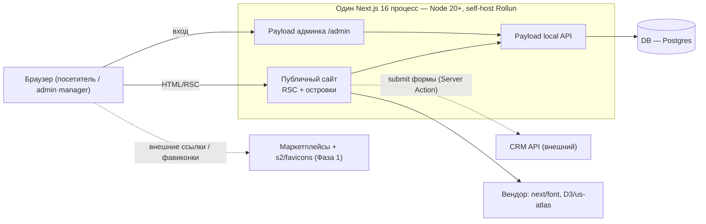
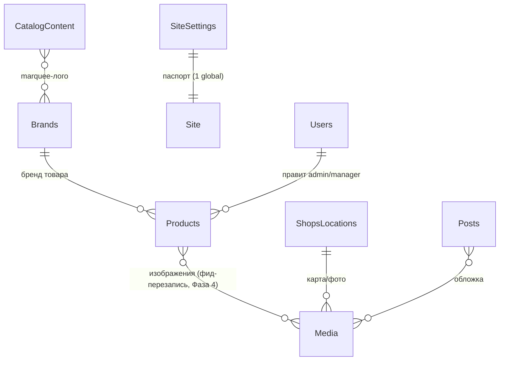

# Architecture Spine — Сайт Rollun

Контракт консистентности для имиджевой B2B-витрины Rollun. Приоритет №1 — **пиксель-в-пиксель по Handoff** (desktop+mobile, 6 страниц); единственная функция сверх визуала в Фазе 1 — рабочая Contact-форма. CMS (Payload) подключается слоями в Фазах 2–4 без потери пиксель-фиделити. Ниже — только инварианты, которые нельзя прочитать с уже написанного кода; всё структурное (стек, дерево) — seed, им владеет код после появления.

## Design Paradigm

**Islands Architecture поверх захардкоженной оболочки с типизированными слотами контента.**

- **Server-first.** Страницы и секции — React Server Components (RSC). Интерактив изолирован в явно помеченные `'use client'` листья-**островки**. Оболочка (вёрстка/структура) — код; контент — типизированные слоты.
- **Контент в одну сторону:** Payload local API → RSC → HTML. Браузер контент не фетчит.
- **Раскладка семейств → директории:** `app/(site)/*` — публичные RSC-роуты; `components/shell` — общий header/footer; `components/islands` — клиентские листья; `globals`/`collections` — модель Payload; `content` — статические контент-инстансы Фазы 1; `styles/theme.css` — единственный источник DS-токенов.

## Invariants & Rules

Durable-ядро. Каждый блок: **Binds** (что governs), **Prevents** (расхождение, которое он гасит), **Rule** (проверяемое ограничение). `[ADOPTED]` — суть решена апстримом (PRD/addendum/владелец); механизм — решение архитектуры. `[ASSUMPTION]` — вывод под правку на ревью.

Направление зависимостей (кто на кого может зависеть) — это правило:



Правило направления: presentation зависит внутрь — на контент-контракты (`Types`) и local API; **островки зависят только от пропсов (`Types`), никогда от local API** (нет клиентского фетча контента); путь submit идёт `остров → Server Action → внешний CRM`, не касаясь хранилища контента; `Types` не зависят ни от чего.

### AD-1 — Server-first: граница server/client — островки-листья

- **Binds:** all (все страницы, layout, интерактив)
- **Prevents:** страница помечает целую секцию `'use client'` → теряет SSR/пиксель/перф; одно и то же поведение реализовано по-разному на разных страницах.
- **Rule:** страница и секция — Server Components. **Принцип: всякий интерактив или анимация = листовой client-островок; контент — только пропсами (островок не фетчит).** Известный набор островков: мобильное шасси (drawer + scroll-lock, header shrink-on-scroll, footer-аккордеоны, reveal-on-scroll IntersectionObserver — из `mobile.js`), hero-bloom (Home, ч/б→цвет по IO), product-line слайдер (Home), count-up счётчики, coin-tower (canvas) + workforce/people-фигуры (About «Automation»), D3-карта US Presence (About), Catalog desktop line-chooser + фильтр-бар, Catalog card-slider + quick-view + marquee-hover-pause, `ContactForm` (все режимы), map-табы (Contact), lightbox сертификата (Our Brands mobile). Новый интерактив добавляется как островок по тому же принципу, а не помечает `'use client'` целую секцию. **Мобильное шасси — одна общая реализация;** каждая mobile-страница использует её (в т.ч. Catalog Mobile, который в прототипе не грузит `mobile.js`), не инлайнит своё.

### AD-2 — Одна дизайн-система: единственный источник токенов = Tailwind v4 `@theme` `[ADOPTED: одна DS — NFR-1]`

- **Binds:** all визуальное; NFR-1
- **Prevents:** 6 desktop-страниц + `mobile.css` копируют inline `:root` → дрейф оранжа/весов шрифта/spacing; повторный ввод осиротевшей DS (`colors_and_type.css`, Archivo/`#EA7B08`).
- **Rule:** все DS-токены прототипов (цвета, типошкала, spacing, radii, shadows, easing) живут в одном `@theme`-блоке (Tailwind v4, CSS-first — эмит и как `:root`-переменные, и как утилиты). Семейства **Poppins/Roboto/Karla** (+ **Caveat** на About), оранж **`#EF7F1A`** — единственный. Поверхностно-специфичные значения (mobile `--bg:#D2D2D2`, `--shell-w:440px`) — **scoped-переопределения тех же токен-имён**, не новые имена; канонический набор имён владеет `styles/theme.css`. `colors_and_type.css` игнорируется. Компонент не пишет сырой цвет/шрифт/spacing-литерал, существующий как токен. **Tie-break:** при конфликте нормализации-в-токен со случайным не-канон литералом прототипа (напр. About `.team-tile` `#ea7b07`) побеждает литерал — дизайн источник истины (AD-13 > AD-2).

### AD-3 — Desktop и mobile — две отдельные композиции, переключение на ~768px `[ADOPTED: раскол+порог — NFR-2]`

- **Binds:** all страницы + layout; NFR-2
- **Prevents:** одна страница делает только-CSS-адаптив, другая — два дерева → mobile-поведения (drawer/аккордеоны/статичная карта) садятся вразнобой, пиксель рушится на переходе.
- **Rule:** каждая страница поставляет **две композиции** (desktop | mobile) над общими DS и контентом. **Механизм (правило, не допущение):** обе композиции SSR-рендерятся в DOM, переключение **только CSS-медиа на 768px**; JS-gated выбор (`useMediaQuery`/условный рендер) и server-side UA-сниффинг **запрещены** (иначе hydration-mismatch, SSR/SEO-асимметрия, разное монтирование островков). Ниже 768px рендерится mobile-композиция (шелл `--shell-w`, letterbox); desktop-брейкпоинты <768 (560/720/760) в прод **не отгружаются**. Каждая desktop-страница держит **свои** внутренние брейкпоинты, выведенные из её файла (реально до 1280, не 1100). **Медиа:** на данном вьюпорте грузится ровно **одна** композиция картинок (art-direction `<picture>`/`source media` или `next/image` `sizes`) — тяжёлые hero (15–18 МБ) нельзя тянуть в оба дерева.

### AD-4 — Контент только с сервера через local API `[ADOPTED: addendum A]`

- **Binds:** все страницы; FR-12, FR-13, NFR-5
- **Prevents:** клиентский фетч контента (waterfalls, не-SSR, пиксель/перф-регресс) на одной странице vs серверный на другой; ослабляет гарантию «менеджер физически не ломает дизайн».
- **Rule:** RSC читают контент через Payload **local API** (`getPayload`) на request/build-времени; сетевого хопа к CMS из браузера нет. Островки получают контент пропсами.

### AD-5 — Типизированные слоты: Global на страницу, без page-builder `[ADOPTED: PRD §5, addendum E]`

- **Binds:** вся контент-модель; FR-12, FR-13; SM-C2
- **Prevents:** одна страница смоделирована гибкими блоками, другая — фикс-полями → инвариант «нельзя сломать дизайн» фрагментируется; разный UX редактирования.
- **Rule:** один Payload **Global на страницу** (`HomeContent`, `AboutContent`, `CatalogContent`, `BrandsContent`, `ShopsContent`, `ContactContent`) + `SiteSettings` (паспорт) + коллекции (`Products`, `Brands`, `Shops`, `Media`, `Posts`, `Users`). **Нет** абстрактной `Page`, **нет** block/free-form page-builder. Слот = типизированное поле под маркер захардкоженной вёрстки; вёрстка/структура полем контента не бывает.

### AD-6 — Граница «код vs контент» фиксирована по 4 уровням текучести `[ADOPTED: addendum C]`

- **Binds:** классификация всякого текста/ассета; FR-13
- **Prevents:** страница A правит заголовок через CMS, страница B хардкодит тот же класс текста → разная редактируемость + случайная поверхность слома дизайна.
- **Rule:** каждый текст/ассет классифицируется: 🔴 живое (картинки, товары) → CMS · 🟡 правимый текст живых блоков → CMS · 🟢 паспорт (тел/адрес/соц/часы — атомы по AD-14) → `SiteSettings` · ⚫ гвоздями (вёрстка, структура, юр/статичный текст, микрокопи) → код. Слотами становятся только 🔴🟡🟢; ⚫ остаётся в коде. **Tie-break на границе 🟡↔⚫:** по умолчанию ⚫ (код); поле становится слотом только явным промоушеном — при сомнении гвоздями (защищает SM-C2). 🟡-текст держит бренд-голос §F (owner-review в Фазах 2–3).

### AD-7 — Страница = чистая функция типизированного контент-объекта (шов роадмапа)

- **Binds:** все страницы; переход Фаза 1 → Фазы 2–3; SM-C1
- **Prevents:** Фаза 1 хардкодит контент инлайн в JSX → Фазы 2–3 требуют переписать страницу (rework), и пиксель едет при подключении CMS.
- **Rule:** каждая страница — чистая функция типизированного контент-объекта. Фаза 1 подаёт **статический инстанс** этого типа (`content/*`); Фазы 2–3 подают тот же тип из Payload Global. Подключение CMS меняет **источник, не разметку** → пиксель между фазами не меняется. Граница компонента уже совпадает с будущим слотом. **Контракт типа:** TS-тип контент-объекта = Payload-генерённый тип этого Global (или его typecheck-совместимое подмножество); форма полей Payload (group-вложенность, `id` в массивах, union `number|Media`, Lexical richtext, nullability) задаётся сразу, и статические инстансы Фазы 1 typecheck-аются против канонического типа в CI — иначе подключение CMS = переписать страницу + пиксель-дрейф.

### AD-8 — Единый `ContactForm` → единый приёмник (CRM), три режима показа `[ADOPTED: PRD §4.8]`

- **Binds:** Home, About, Contact; FR-9, FR-10, FR-11; SM-2
- **Prevents:** три страницы строят свою форму (разные поля/валидация/endpoint); локальное хранение лида.
- **Rule:** один компонент `ContactForm` + один серверный обработчик. Submit идёт через **Server Action**, которая server-side POST-ит на `CRM_API_URL` (env) — URL/секрет CRM браузер не видит. Режимы показа: desktop-модалка (Home/About, `role=dialog`, backdrop/Esc/scroll-lock), инлайн (Contact), mobile-триггер → навигация на `/contact`. Поля: имя, email, телефон, компания, тема (фикс-список), сообщение. Анти-спам (honeypot + серверная валидация) — на единственном пути. **Нет** `Submissions`, **нет** mailer; лид на сайте не хранится.

### AD-9 — Офферы — рантайм-деривация, не поле; шов `sku`/`externalId` с Фазы 1 `[ADOPTED: addendum C]`

- **Binds:** Catalog; FR-4, FR-5; фид Фазы 4
- **Prevents:** офферы как редактируемые данные (дрейф, неверные маркетплейсы на линию); ретрофит фид-шва позже (rework).
- **Rule:** `offers` (+ репрезентативная цена) вычисляются **одним детерминированным серверным** вызовом `buildOffers` из продуктовой линии (Health → Amazon/eBay; Automotive → Amazon/eBay/Walmart); это **не** поле Payload. quick-view-островок получает готовые офферы **пропсами** — импорт `lib/offers.ts` в client-островок запрещён (иначе один SKU покажет разные цену/офферы на карточке и в quick-view). На `Products` с Фазы 1 зарезервированы `sku`/`externalId`; фид-перезаписываемые поля (цена, картинки, наличие) изолированы под Фазу 4.

### AD-10 — Ревалидация: on-demand через хуки Payload, согласовано с моделью кэша Next 16 `[ADOPTED: NFR-5]`

- **Binds:** все страницы (Фаза 2+); FR-13, NFR-5
- **Prevents:** одна страница закэширована навсегда (правки не видны), другая динамична (медленно) → разная свежесть.
- **Rule:** страницы статически рендерятся; правка контента триггерит **`revalidateTag`** (не `revalidatePath`) из `afterChange`-хуков Payload — каждый Global имеет канонический тег, паспорт/shell тегирует **все** поверхности (mobile+desktop), иначе desktop/mobile одной страницы разойдутся в свежести. Согласовано с явной моделью Next 16: `cacheComponents: true` + `use cache` + `cacheTag` (без тега `revalidateTag` не сработает). Per-page ad-hoc кэша нет. Фаза 1 (хардкод-контент) — полностью статична.

### AD-11 — Внешние ассеты вендорятся под self-host; лого брендов = фавиконки в Фазе 1 `[ADOPTED: NFR-3]`

- **Binds:** all; NFR-3
- **Prevents:** одна страница грузит шрифты/либы с CDN, другая self-host → FOUT/недетерминизм/пиксель-дрейф + риск отвала внешки в проде.
- **Rule:** шрифты (Poppins/Roboto/Karla/Caveat) через `next/font` (self-host, без рантайм Google Fonts); D3/`topojson-client`/`us-atlas` — в бандл (без рантайм jsDelivr); react/`@babel/standalone` скаффолдинг прототипа About **выкинуть** (в Next-сборке не нужен). Единственное исключение — marquee лого брендов через `google.com/s2/favicons` в Фазе 1 (как в дизайне); реальные лого — Фаза 2+.

### AD-12 — Один процесс деплоя: Payload в том же рантайме, local API `[ADOPTED: addendum A, PRD §5]`

- **Binds:** деплой; операционный конверт
- **Prevents:** контент через сетевой API вместо local → сетевой хоп/рассинхрон; отдельный CMS-сервис как операционная нагрузка.
- **Rule:** один процесс **Next.js 16 (Node 20+)** отдаёт публичный сайт + Payload-админку (`/admin`) + local API в одном рантайме. Env: `CRM_API_URL`, DB-коннекшн, `PAYLOAD_SECRET`, revalidate-секрет. Self-host на инфре Rollun. Отклонён headless-CMS отдельным сервисом. `[ASSUMPTION: DB-адаптер — Postgres (stable+рекомендован, Lexical stable); владельцу подтвердить — см. Deferred.]`

### AD-13 — Дизайн — источник истины, воспроизводим как есть, включая дефекты `[ADOPTED: PRD §1, §8; memlog]`

- **Binds:** все страницы; SM-1
- **Prevents:** один билдер «чинит» дефект, другой воспроизводит → визуальная рассогласованность vs Handoff, провал пиксель-приёмки.
- **Rule:** матчим **отрисованный прототип** по каждому целевому брейкпоинту (визуал, не DOM); кросс-страничные расхождения не примиряем. Известные дефекты воспроизводим дословно, пока владелец явно не закажет фикс (§8.8 PRD): Contact — стартовый `src` карты `53%2F27`; Our Shops — видимый Houston TX 77039 vs `q=Conroe` в «GET DIRECTIONS»; расхождения часов по страницам; mobile-About без контакт-модалки + статичная карта; lightbox сертификата только в mobile-DOM.

## Consistency Conventions

Дефолты там, где независимые билдеры дрейфят.

| Concern | Convention |
| --- | --- |
| Роуты | `app/(site)/` сегменты: `/` (Home), `/about`, `/catalog`, `/brands`, `/shops`, `/contact`. Payload-админка — `/admin`. |
| Именование | Page-глобалы `<Page>Content` (PascalCase); коллекции — PascalCase множественное (`Products`); островки — под `components/islands/`, суффикс `.client.tsx`; per-page контент-тип `<Page>Content` (TS) — контракт страницы; DS-токены — kebab в `@theme`. |
| Данные и форматы | id — дефолт Payload; даты — ISO-8601; env-переменные — UPPER_SNAKE; TS-тип контент-объекта на страницу — единственный контракт между RSC, островком и (позже) Payload Global. |
| Мутация состояния | Контент меняется **только** через Payload-админку → `afterChange`-хук → `revalidatePath`/`Tag`. Лид формы — только через Server Action → CRM (не хранится). Прочей записи с сайта нет. |
| Ошибки | Форма: при ошибке доставки — понятное сообщение + сохранение введённого для повтора (FR-9). Провал POST в CRM логируется server-side. |
| Auth | Встроенный auth Payload; роли `admin`/`manager` (матрикс — Deferred). Публичный сайт неаутентифицирован. |
| Изображения | `next/image` везде; в Фазе 2+ — коллекция `Media` (webp, нужные размеры). Плейсхолдеры «Photo N» в Catalog — до реальных фото. |

## Stack

SEED — проверено актуальным на 2026-07-02 (веб); дальше владеет код. Имя+версия; «почему» — в memlog.

| Name | Version |
| --- | --- |
| Next.js (App Router, Turbopack, Cache Components) | 16.2.x |
| React | 19.x |
| TypeScript | 5.x |
| Payload CMS (в процессе, local API) | 3.x (последний стабильный ≥3.77; **не** 4.0 — в разработке) |
| Node.js (рантайм) | 20+ |
| Tailwind CSS (CSS-first `@theme`) | 4.x |
| DB-адаптер Payload | Postgres `[ASSUMPTION]` |
| D3 / topojson-client / us-atlas (карта About, вендор) | 7 / 3 / 3 (states-10m) |
| Шрифты (self-host `next/font`) | Poppins, Roboto, Karla, Caveat |

## Structural Seed

Container / контекст (единый процесс, self-host):



Ключевые сущности (имена+связи; атрибут-инвариант — это AD, не диаграмма):



Дерево-скелет (детали владеет код):

```text
rollun-site/
  src/
    app/
      (site)/
        layout.tsx            # общая оболочка (header/footer), next/font
        page.tsx              # Home
        about/page.tsx
        catalog/page.tsx
        brands/page.tsx
        shops/page.tsx
        contact/page.tsx
      (payload)/admin/        # Payload-админка (генерится)
    components/
      shell/                  # header, footer (RSC + мобильное client-шасси)
      islands/                # 'use client' листья: sliders, count-up, map, quick-view, marquee, map-tabs, lightbox
      contact-form/           # единый ContactForm + Server Action (submit -> CRM)
    content/                  # Фаза 1: статические типизированные контент-инстансы (per page)
    collections/              # Payload: Products, Brands, Shops, Media, Posts, Users
    globals/                  # Payload: SiteSettings, <Page>Content
    lib/
      offers.ts               # buildOffers (рантайм, по линии)
      payload.ts              # getPayload — local API
    styles/
      theme.css               # @theme — единственный источник DS-токенов (Tailwind v4)
  payload.config.ts
  next.config.ts
```

## Capability → Architecture Map

Мост от возможностей PRD к тому, где живут и чем governed. Чеклист аудитора консистентности.

| Capability / Area | Lives in | Governed by |
| --- | --- | --- |
| FR-1 Единый layout | `components/shell` | AD-1, AD-2, AD-3 |
| FR-2…FR-8 Страницы (Home/About/Catalog/Brands/Shops/Contact) | `app/(site)/*`, `content/*` | AD-1, AD-3, AD-7, AD-13 |
| FR-4/FR-5 Catalog: линии, слайдер, quick-view, офферы | `components/islands`, `lib/offers.ts` | AD-1, AD-9 |
| FR-9/FR-10/FR-11 Contact-форма (3 режима, CRM, анти-спам) | `components/contact-form` | AD-8 |
| FR-12 Паспорт компании из одного места | `globals/SiteSettings` | AD-5, AD-6 |
| FR-13 Правка контента без разработчика | `globals/*` + хуки ревалидации | AD-5, AD-6, AD-7, AD-10 |
| NFR-1 Одна DS | `styles/theme.css` | AD-2 |
| NFR-2 Брейкпоинты / переход на 768px | `shell` + композиции страниц | AD-3 |
| NFR-3 Внешние ассеты / детерминизм | `next/font` + вендор-либы | AD-11 |
| NFR-4 Изображения | `Media` + `next/image` | AD-5 |
| NFR-5 Ревалидация контента | `afterChange`-хуки Payload | AD-10 |

## Deferred

Сознательно опущено — с условием, когда вернуться.

- **DB-адаптер** — допущение Postgres; владельцу подтвердить (альтернативы SQLite — простота; Mongo). Revisit: перед Фазой 0-скаффолдом.
- **Хост/домен go-live** (§8.6 PRD) — self-host на инфре Rollun; конкретное окружение/домен от владельца. Revisit: перед деплоем Фазы 1.
- **Контракт CRM API** (§8.1) — URL/формат тела/авторизация от владельца; до этого `CRM_API_URL` через env. Revisit: перед включением формы в проде.
- **Captcha** (§8.2) — нужна ли сверх honeypot и провайдер (reCAPTCHA/hCaptcha/Turnstile). Revisit: если honeypot недостаточен.
- **Матрикс ролей** `admin`/`manager` (§8.3) — Revisit: Фаза 2 (`SiteSettings`).
- **Модель категорий Catalog + связи** `Products`↔`Brands`↔`Shops` (§8.4) — addendum §C — ориентир, деталь владеет код. Revisit: Фаза 3.
- **SEO / доступность (a11y)** (§8.5) — в исходных материалах не заданы, не в скоупе. Revisit: подтвердить требования у владельца.
- **Реальные лого брендов** для marquee (§8.7) — Фаза 1 = фавиконки (AD-11). Revisit: Фаза 2+.
- **Фикс дефектов дизайна** (§8.8) — по умолчанию воспроизводим как есть (AD-13). Revisit: если владелец закажет исправление.
- **Детальные поля Globals/Collections Фаз 2–4** — addendum §C — ориентир; конкретные поля владеет код на своей фазе (это initiative-spine, не per-story деталь).
